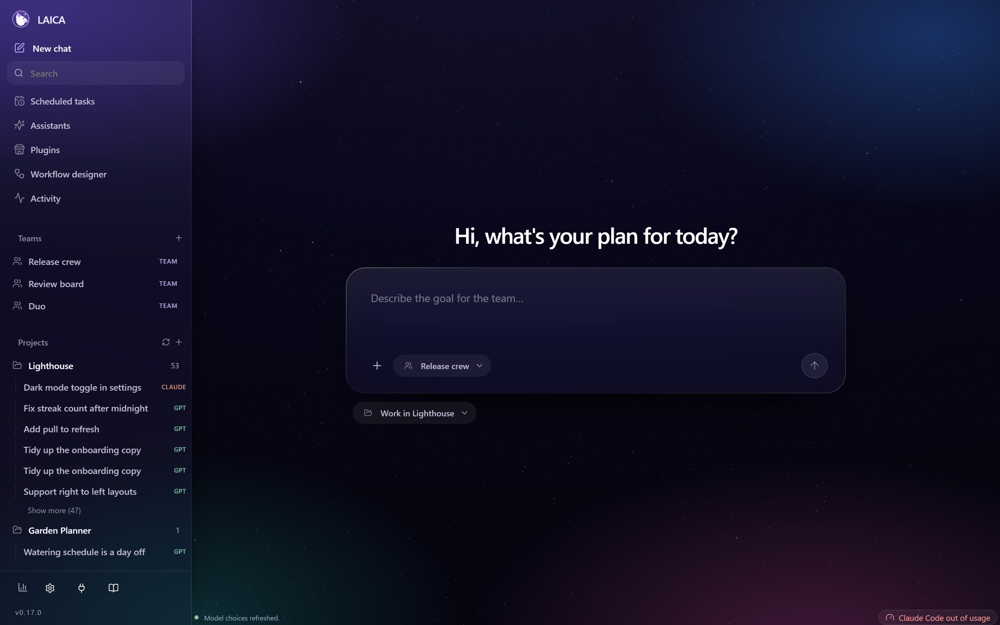
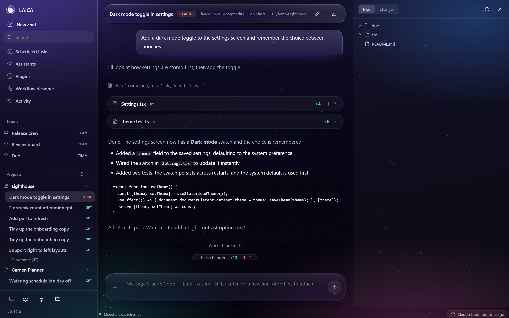
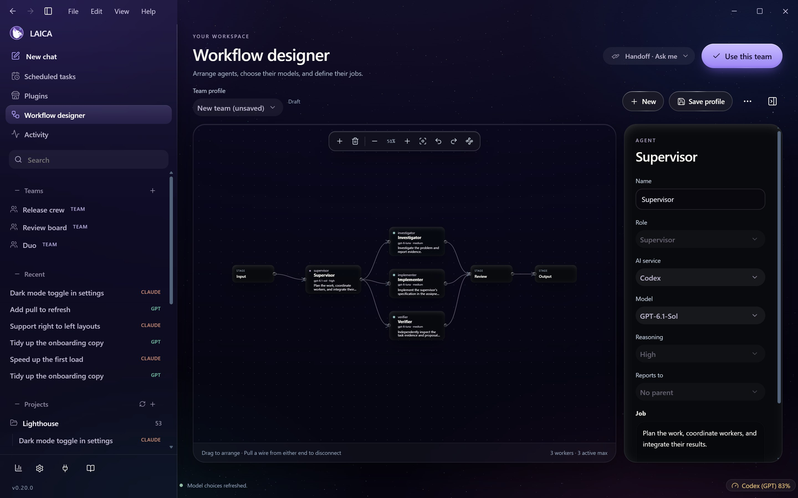
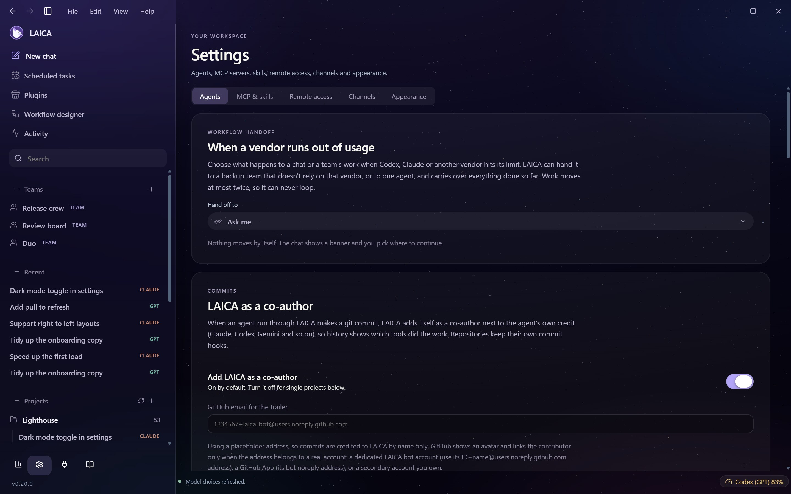
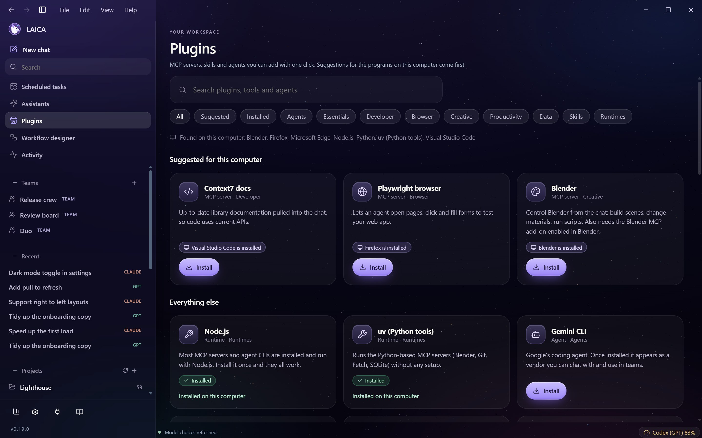
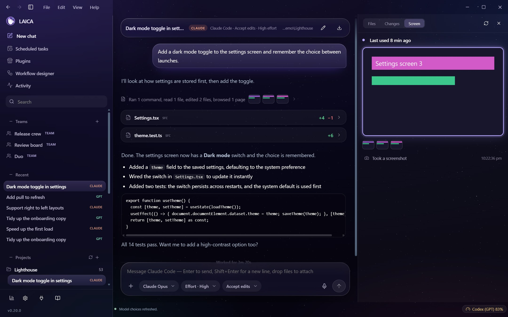

<p align="center">
  
</p>

<h1 align="center">LAICA</h1>

<p align="center"><b>One desktop app for all your coding agents.</b><br>
Run Codex, Claude Code, Gemini and API models side by side, build teams that mix them, and see what each team really costs.</p>

<p align="center">
  <a href="https://github.com/Blacksheep909/LAICA/releases/latest"><b>Download for Windows</b></a> ·
  <a href="docs/getting-started.md">Getting started</a> ·
  <a href="docs/features.md">Features</a> ·
  <a href="CHANGELOG.md">Changelog</a>
</p>

<p align="center"></p>

LAICA is a Windows desktop app built around one idea: the agent CLIs you already use (Codex, Claude Code, Gemini CLI and others) are better together than apart. It gives them one calm place to live, keeps your chats and projects in sync with the tools themselves, and lets you design **teams** of agents from different vendors and then measure which designs actually work.

It runs your own installed tools with your own logins. Nothing is proxied through a LAICA server, because there isn't one.

## What you can do

- **Chat with any agent.** Codex, Claude Code, Gemini, anything you add as a custom CLI, or an API model through your own key. Your existing Codex and Claude Code history shows up automatically, with the same project folders and thread titles.
- **Build mixed-vendor teams.** A leader plans, teammates work in parallel (each in its own chat and optionally its own git worktree), the leader reviews. Every member can be a different vendor and model.
- **Tag-team two agents.** Pick a partner model for any chat (say Claude Opus alongside Codex) and let them take turns: when one runs out of usage LAICA hands the work to the other with only what it hasn't seen, and hands it back when the first has reset, again and again, with a HANDOFF.md in your project that stays up to date.
- **Never get stuck on a usage limit.** When a vendor runs out, LAICA can hand the chat or the whole team's work to a backup team or another agent, with everything done so far carried over.
- **Know what it costs.** Analytics shows tokens, an API-equivalent cost estimate (priced from Anthropic's, OpenAI's and Google's own pricing pages, re-checked every time LAICA starts), and a **Teams** tab that compares your team designs: success rate, time per run, cost per run, how parallel the work really was, leader overhead and which teammate costs what.
- **See what happened.** Activity is written in plain sentences, grouped like "Ran 2 commands, edited 3 files", with per-file diffs, a turn summary and thumbnails of the screenshots and images the agent saw or made (click for full size).
- **Watch agents work.** A Screen tab shows what an agent sees when it uses a browser, and optional **LAICA computer use** lets Claude Code and Codex use your screen, mouse and keyboard with a slim lavender outline around the screen. Press Esc to stop them at once.
- **Stay in control.** Pause and resume running work, queue messages, undo with Ctrl+Z, drag in files, paste images, dictate by voice, export chats as Markdown.
- **Extend it.** A plugin library with one-click install of MCP servers, skills and agent CLIs, suggested first for the programs found on your PC.
- **Give credit.** Commits made by agents through LAICA carry a `Co-authored-by: LAICA` trailer next to the agent's own credit. On by default, off per project if you like.

## Screenshots

<table>
<tr>
<td width="50%"><br><sub><b>Chat</b> with files-changed cards and a turn summary</sub></td>
<td width="50%"><br><sub><b>Teams</b>: Claude, Codex and Gemini on one team, with a seamless agent swap</sub></td>
</tr>
<tr>
<td><br><sub><b>Workflow designer</b>: arrange agents, pick any installed vendor and model for each</sub></td>
<td><br><sub><b>Settings</b>: workflow handoff, LAICA as a co-author and updates</sub></td>
</tr>
<tr>
<td><br><sub><b>Plugin library</b> with suggestions for what is installed on your PC</sub></td>
<td><br><sub><b>Screen tab</b>: what the agent sees, with the lavender live frame</sub></td>
</tr>
</table>

*All screenshots use invented demo data.*

## Install

1. Download **`LAICA-Setup-<version>.exe`** from the [latest release](https://github.com/Blacksheep909/LAICA/releases/latest) and run it. It installs for your user only (no administrator rights).
2. Windows may show a SmartScreen warning because **the builds are not code-signed**. Choose *More info* then *Run anyway* if you trust this repository. You can verify the download against `SHA256SUMS-<version>.txt` on the release page, or build it yourself.
3. Install at least one agent CLI, for example [Codex](https://github.com/openai/codex) or [Claude Code](https://docs.claude.com/en/docs/claude-code), and sign in to it as you normally would. LAICA finds it automatically.

Prefer a zip? `LAICA-<version>-win-x64.zip` is the same program without the installer: unzip anywhere and run `LAICA.exe`.

**Requirements:** Windows 10 or 11 (64-bit) with the Microsoft Edge WebView2 Runtime (already present on Windows 11 and current Windows 10). Git is needed for worktrees, diffs and commits.

A step-by-step walkthrough is in [docs/getting-started.md](docs/getting-started.md).

## Build from source

You need Windows, the .NET Framework 4 compiler that ships with Windows (`csc.exe`), Node.js 22 or newer and pnpm 11.

```powershell
./Build.ps1 -Development    # compiles the app and the checks into build/
./Test.ps1                  # runs every check
./tools/Package.ps1         # makes dist/LAICA-<version>-win-x64.zip and LAICA-Setup-<version>.exe
```

More in [docs/releases.md](docs/releases.md) and [CONTRIBUTING.md](CONTRIBUTING.md).

## Privacy

LAICA keeps everything on your computer. It has no accounts, no telemetry and no server. It reads the local history files of Codex and Claude Code to show your chats and usage, and never reads their login tokens. See [docs/privacy.md](docs/privacy.md) for exactly what is read, what is stored and what leaves your machine.

## Documentation

| | |
| --- | --- |
| [Getting started](docs/getting-started.md) | Install, connect your agents, first chat, first team |
| [Features](docs/features.md) | Everything LAICA does, by area |
| [Architecture](docs/architecture.md) | How the app is put together |
| [Privacy](docs/privacy.md) | What is read, stored and sent |
| [Releases](docs/releases.md) | Building, packaging and publishing |
| [Contributing](CONTRIBUTING.md) | How to help |
| [Third-party notices](THIRD_PARTY_NOTICES.md) | Licences of the software LAICA includes |

## License

LAICA's own code, documentation and images are released into the public domain under [The Unlicense](LICENSE). Do whatever you like with them. Third-party components keep their own licences, listed in [THIRD_PARTY_NOTICES.md](THIRD_PARTY_NOTICES.md).
