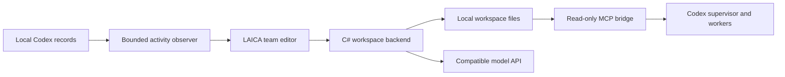

# Architecture

LAICA has a Windows desktop host, a React interface, a state backend and a separate stdio MCP bridge.

## Source map

| Path | Responsibility |
| --- | --- |
| `frontend/src/Graph.tsx`, `graph-model.ts` | Canvas gestures, camera, connections, hierarchy and undo |
| `frontend/src/ActivityPage.tsx`, `activity-model.ts` | Chat/crew overview, work categories and recorded logs |
| `host/GlassHost.cs` | WebView2 window, message boundary, file dialogs and native lifecycle |
| `host/WorkspaceBackend.cs` | Saved state, profiles, services and run commands |
| `core/Laica.Runtime.cs` | Plan validation, model discovery and team execution |
| `core/Laica.Services.cs` | Loopback API validation, requests and DPAPI key storage |
| `core/Laica.Observer.cs` | Local Codex record parsing, retained events, redaction and summaries |
| `core/Laica.Bridge.cs` | Read-only `get_team` and `get_activity` MCP tools |
| `core/Laica.Paths.cs` | Shared GUI/bridge data-directory resolution |

The GUI serves its bundled frontend through a private `https://laica.local` WebView2 origin. Its content policy restricts scripts and connections to that origin. Model calls happen through the C# backend. External navigation is constrained in the host.

Workspace mutations and activity observations use separate command gates so slow record reads do not hold up the ordinary UI command queue. The overview samples a bounded set of recent chats and caches reads; the selected chat is polled more frequently.

Codex work and local service work have different execution paths. Codex keeps the task in its own chat and reads the selected team through MCP. Local services run a bounded text workflow within LAICA and return the answer to Local runs. A local model has no native Codex browser, shell or computer tools through this adapter.

The Activity parser consumes local formats that can change with Codex updates. Unknown fields are tolerated where possible. No animation should imply an action, result or liveness that the record does not establish.
