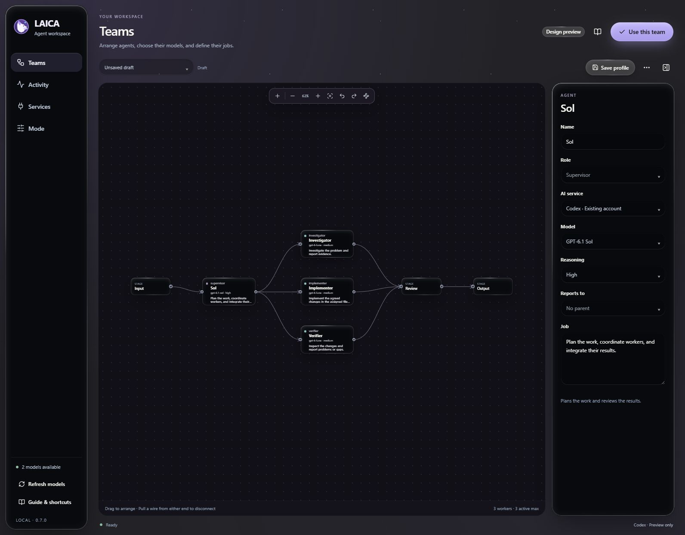
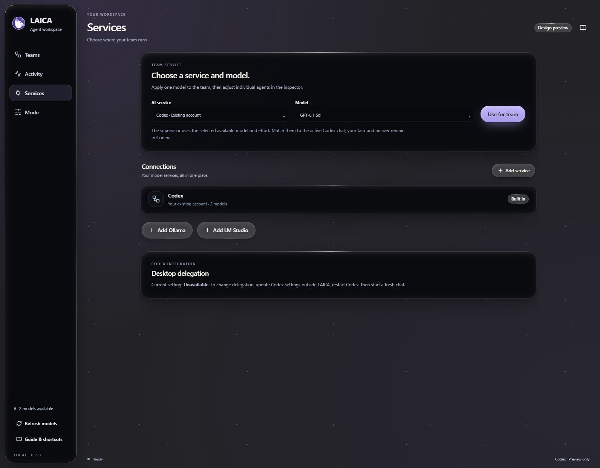
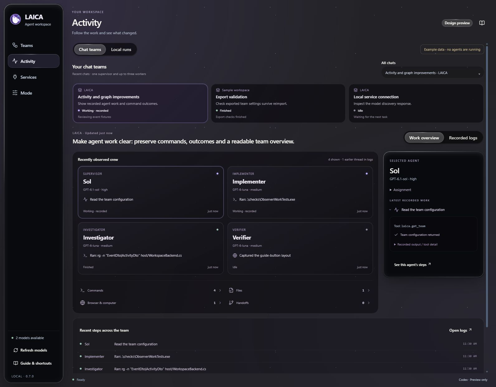
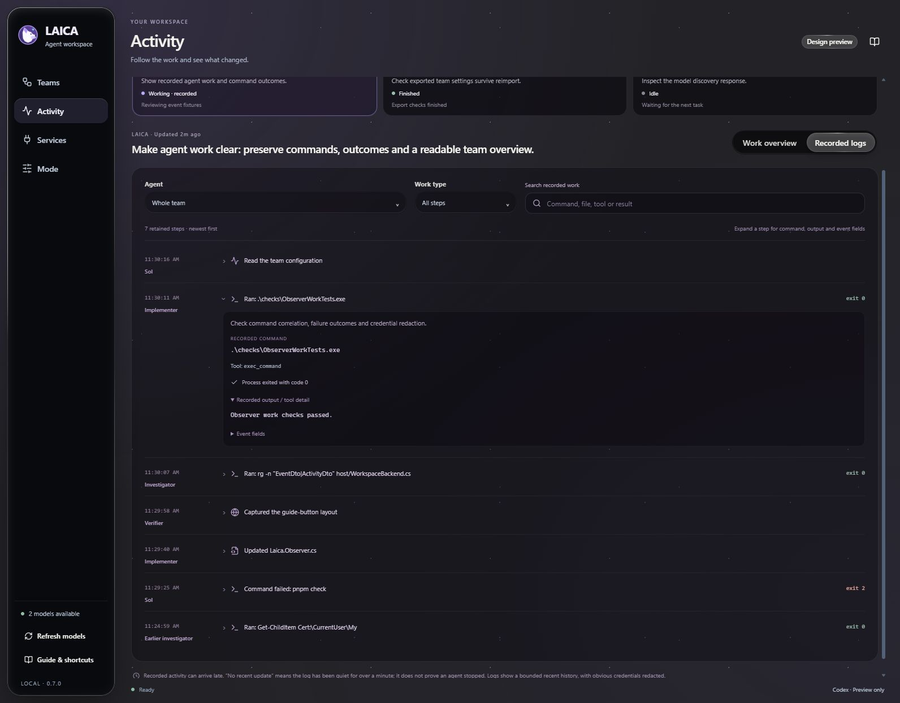

# Getting started with LAICA

LAICA is a Windows workspace for setting up agent teams and viewing recorded work. This guide walks through building the public source preview, connecting it to Codex, and exploring Activity. The current public build is an unsigned development preview; there is no signed installer download.

## 1. Prepare Windows and get the source

Use a Windows x64 PC with:

- Node.js **22.13 or newer**
- pnpm **11.19.0**
- The .NET Framework C# compiler at `%WINDIR%\Microsoft.NET\Framework64\v4.0.30319\csc.exe`
- Microsoft Edge **WebView2 Runtime**
- Codex CLI or the Codex app, signed in, if you want to hand work to Codex

Install the [WebView2 Runtime](https://developer.microsoft.com/en-us/microsoft-edge/webview2/) if it is not already present. Get the source using either option:

- **With Git:** open PowerShell and run the commands below.
- **Without Git:** open the [repository](https://github.com/Blacksheep909/LAICA), choose **Code → Download ZIP**, then right-click the downloaded ZIP and choose **Extract All**. Open the extracted folder, right-click an empty area and choose **Open in Terminal**.

```powershell
git clone https://github.com/Blacksheep909/LAICA.git
cd LAICA
```

There is no signed binary download to install.

Open PowerShell in the source folder. If pnpm is not installed, install the pinned version and build the development preview:

```powershell
npm install --global pnpm@11.19.0
./Build.ps1 -Development
```

The build uses the pinned frontend lockfile and checks the hashes of the vendored WebView2 SDK files. To run the project checks, use:

```powershell
./Test.ps1
```

When the build finishes, open the app with:

```powershell
./build/LAICA.exe
```

### Optional per-user installation

You can install the unsigned development build into your user profile and create shortcuts:

```powershell
./Install.ps1 -Development
```

The default program folder is `%LOCALAPPDATA%\Programs\LAICA`. You can skip shortcut creation with `-NoShortcuts`. An unsigned preview may be blocked by Smart App Control or other Windows protections. Keep those protections enabled; do not bypass or disable them. If Windows blocks the preview, stop and wait for a trusted signed release.

## 2. Connect the Codex account and select a team

1. Open **Services** and choose **Codex · Existing account**.
2. Select **Refresh models** in the lower-left corner. Wait for the model list to finish loading, then choose a model your signed-in Codex account can use and select **Use for team**.
3. Open **Teams**. Select the supervisor node (the root of the graph) and set its model and reasoning to match the model and reasoning of the Codex chat you plan to use. The example graph is a draft, so review every worker's model, reasoning, role, job, and **Reports to** assignment too. Keep only models and worker tools available in your Codex host.
4. Select **Save profile** and give the team a name if you want to reuse it. Saving a profile does not activate it.
5. Select **Use this team** at the top of **Teams**. LAICA marks the selected team for the bridge to provide to Codex.



*Development preview; example data, not a live run.*



*Development preview; example data, not a live run.*

## 3. Register the read-only bridge with Codex

These commands require the `codex` CLI to be available in PowerShell. Register the bridge from the default installation folder:

```powershell
codex mcp add laica -- "$env:LOCALAPPDATA\Programs\LAICA\LAICA.Bridge.exe"
codex mcp list
```

If you are running directly from the source folder, run this command from that folder instead:

```powershell
codex mcp add laica -- "$PWD\build\LAICA.Bridge.exe"
```

For a custom install folder, substitute its full path. If `codex` is not recognised, use the [official MCP configuration instructions](https://learn.chatgpt.com/docs/extend/mcp?surface=cli) to register that executable as a stdio server. The bridge is a stdio MCP server; you do not need to start it yourself. It provides read-only `get_team` and `get_activity` tools and does not edit Codex configuration or start models.

Close and reopen Codex so it loads the new MCP server, then start a **fresh chat**. Ask Codex: **“Use my LAICA team for this task: [describe the task].”** The current chat's supervisor model and reasoning must match the LAICA root. Codex remains responsible for running the task and returning its answer in that chat.

If the model list is empty, make sure Codex is signed in, select **Refresh models** again, and confirm that the chosen model is available to your account. If LAICA reports the Codex delegation mode as **Unavailable** or **unknown**, Codex's `[agents] enabled` setting could not be read. The **Services → Codex integration** section in LAICA is a read-only status display. Change delegation in Codex's own settings or configuration if needed, restart Codex yourself, and use a fresh chat. LAICA reads that setting; it does not change it.

## 4. Explore Activity

Choose **Activity** after Codex has started the task. **Work overview** groups recent recorded work by chat and shows the supervisor with up to three recently observed workers. Select an agent to inspect its assignment, recent action, and files. **Recorded logs** lets you filter by agent or work type, search recorded steps, and expand a step to see the command, purpose, output, and outcome when those details were captured.



*Development preview; example data, not a live run.*

Activity is based on local Codex records. It can appear after a delay, and a missing command, output, or exit status means Codex did not expose that detail in the record. “No recent update” means the log has been quiet; it does not prove a worker has stopped. If there is no activity, choose the relevant chat from the **All chats** dropdown, allow time for the automatic update, and check that Codex has recorded work locally. Activity can observe those records independently of the bridge or team selection. If you use a custom `CODEX_HOME`, LAICA must read the same directory as Codex. You can also reopen **Activity**.



*Development preview; example data, not a live run.*

## 5. Run a team against a local model API (optional)

This is a separate route from the Codex handoff. Start an OpenAI-compatible API server in Ollama or LM Studio, then in **Services** add a connection using the base URL shown by that app. Common local defaults are `http://127.0.0.1:11434/v1` for Ollama and `http://127.0.0.1:1234/v1` for LM Studio; check the app if you changed its port. Save the connection, select **Refresh models**, choose a discovered model, and select **Use for team**. Return to **Teams**, enter a task, and choose **Run team**. The reviewed answer appears in **Activity → Local runs**.

Local API calls may use HTTP only for loopback addresses. A remote API must use HTTPS. LAICA sends the task and agent text context to the selected API service; this adapter gives local models no Codex browser, shell, or computer-use tools, and does not operate your computer or edit project files.

## Graph shortcuts

The graph's **Guide & shortcuts** panel also lists these controls:

- Drag a node to arrange it; use the mouse wheel to zoom.
- Pan with the middle mouse button, or hold **Space** and drag.
- Hold **Shift** and click to select several nodes. Hold **Shift** and drag from a socket to connect a wire.
- Pull a wire from either socket and release over empty space to disconnect it. Press **Esc** to cancel a gesture.
- Use **Ctrl + right-drag** to cut wires, **Ctrl + Z** to undo, **Ctrl + Y** to redo, and **Delete** to remove a worker or selected wire.
- Open **Graph tools → Find** to search for a node. Graph tools also contains arrange, selection, and duplication actions.

See the [main README](../README.md) for privacy and data-storage details, or [report an issue](https://github.com/Blacksheep909/LAICA/issues) with a concrete trigger and expected result. Remove private paths, commands, and conversation text before sharing logs.
